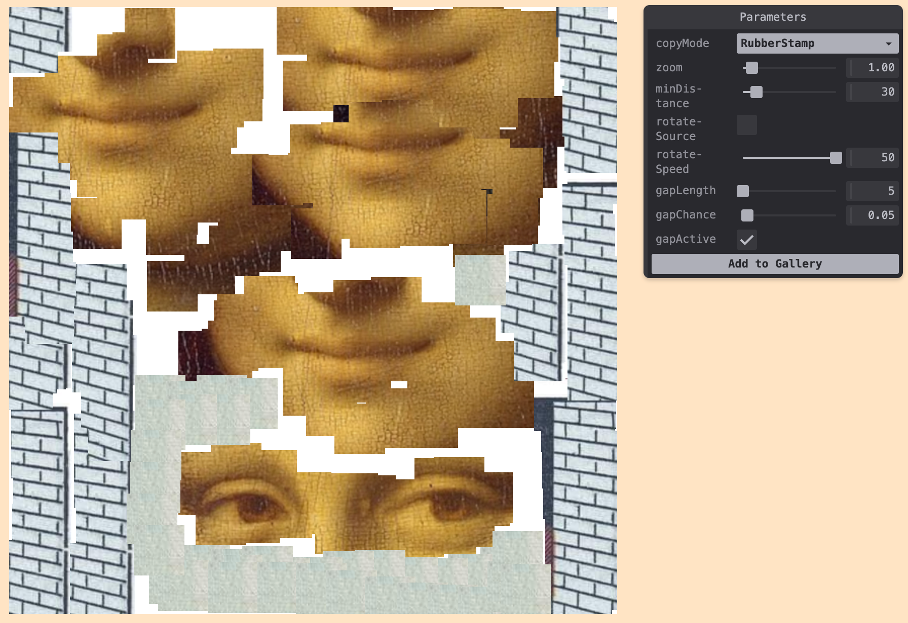
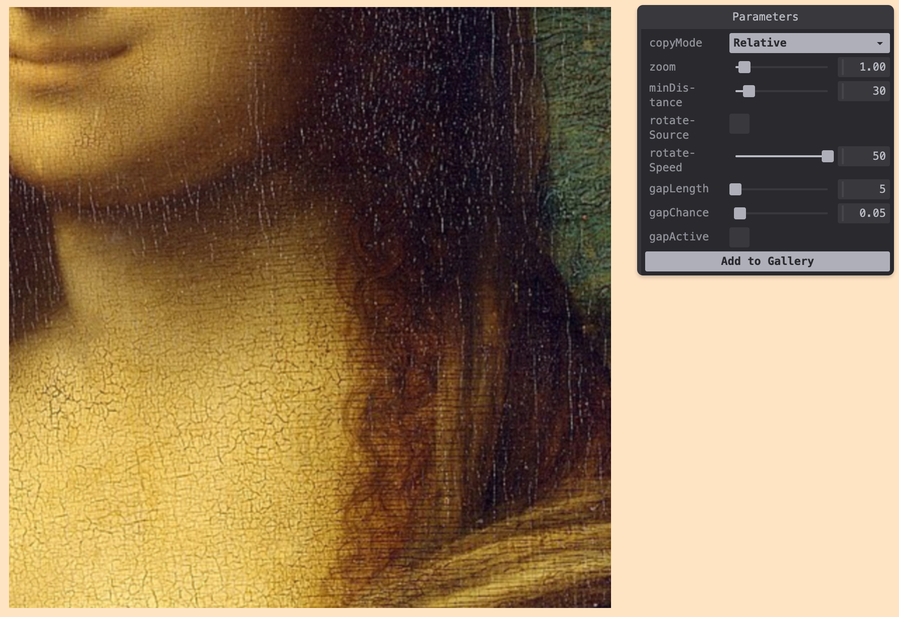

# crude collage painter

Interactive collage painting tool for creating digital art.

Built with p5.js as part of the GenArt creative coding collection.

- inspired by https://timrodenbroeker.de/lowtech-painting-machine/

> **⚠️ This repository has moved to a monorepo**
> 
> Active development now happens in the [GenArt Monorepo](https://github.com/michaelpaulukonis/genart-monorepo).
> 
> This repository remains active **only** for GitHub Pages deployment. The source code here is no longer maintained.

---






## 🔗 Links

- **Live Demo:** [https://michaelpaulukonis.github.io/crude-collage-painter/](https://michaelpaulukonis.github.io/crude-collage-painter/)
- **Monorepo:** [https://github.com/michaelpaulukonis/genart-monorepo](https://github.com/michaelpaulukonis/genart-monorepo)
- **Source Code:** [apps/crude-collage-painter/](https://github.com/michaelpaulukonis/genart-monorepo/tree/main/apps/crude-collage-painter)
- **Documentation:** [View in monorepo](https://github.com/michaelpaulukonis/genart-monorepo/tree/main/apps/crude-collage-painter/README.md)


## Development

All development happens in the monorepo. To work on this project:

```bash
git clone https://github.com/michaelpaulukonis/genart-monorepo.git
cd genart-monorepo
pnpm install
nx dev crude-collage-painter
